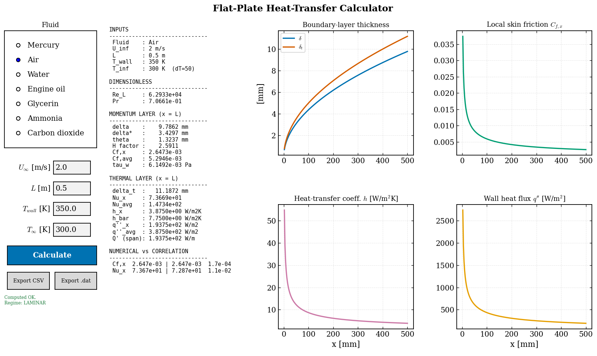
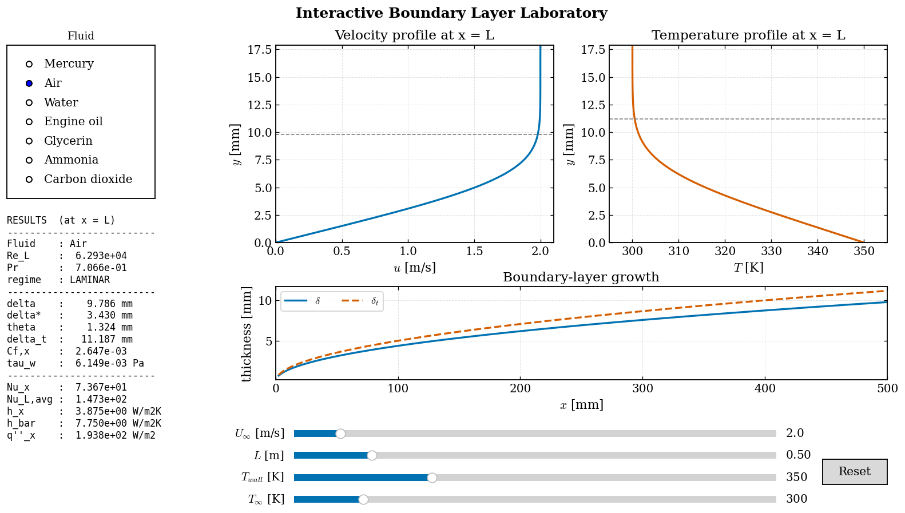

# Boundary Layer Laboratory

**A virtual laboratory for the momentum and thermal boundary layers over a flat plate.**

Companion educational software for the book
*Heat Transfer: Analysis, Computation, and Verification*
by **I. L. Ferreira**.
This bonus material is **not** part of the printed book — it lives here in the
companion GitHub repository.

The Boundary Layer Laboratory bridges **fluid mechanics** and **convective heat
transfer** by letting the reader compute the velocity and temperature boundary
layers *from first principles* — solving the Blasius and thermal-energy
equations numerically — and then connecting those solutions to the engineering
correlations used in practice. The emphasis is on **connecting theory,
numerical computation, and engineering application**, not merely on solving
equations.

Everything uses **only NumPy, SciPy and Matplotlib**, follows a modular
object-oriented design, is documented at the class/function level, and works in
**SI units** throughout.

---

## Physical background

For steady, incompressible, laminar flow over an isothermal flat plate with
zero pressure gradient, the similarity variable and stream function

$$\eta = y\sqrt{\frac{U_\infty}{\nu x}}, \qquad \frac{u}{U_\infty}=f'(\eta)$$

reduce the momentum and energy equations to two ordinary differential
equations:

| | Equation | Boundary conditions |
|---|---|---|
| **Momentum (Blasius)** | $f''' + \tfrac12 f f'' = 0$ | $f(0)=0,\ f'(0)=0,\ f'(\infty)=1$ |
| **Energy (thermal)** | $\theta'' + \tfrac{\mathrm{Pr}}{2} f\,\theta' = 0$ | $\theta(0)=0,\ \theta(\infty)=1$ |

with $\theta = (T-T_w)/(T_\infty-T_w)$. The wall values
$f''(0)$ and $\theta'(0)$ set, respectively, the skin friction and the heat
transfer:

$$C_{f,x} = \frac{2 f''(0)}{\sqrt{\mathrm{Re}_x}}, \qquad
\mathrm{Nu}_x = \theta'(0)\,\mathrm{Re}_x^{1/2}.$$

---

## Installation

Requires Python ≥ 3.8.

```bash
# from the repository root
pip install -r requirements.txt      # NumPy, SciPy, Matplotlib
# optional: install the package itself (editable)
pip install -e .
```

No installation is strictly necessary — the example scripts add the repository
root to `sys.path` so they run in place.

---

## The six modules

| # | Module | File | Entry point |
|---|--------|------|-------------|
| 1 | Blasius momentum boundary layer | `blayerlab/blasius.py` | `BlasiusSolver` |
| 2 | Thermal boundary layer | `blayerlab/thermal.py` | `ThermalSolver` |
| 3 | Flat-plate heat-transfer calculator | `blayerlab/calculator.py`, `calculator_gui.py` | `FlatPlateCalculator`, `CalculatorGUI` |
| 4 | Interactive laboratory (GUI) | `blayerlab/interactive.py` | `InteractiveLab` |
| 5 | Correlation verification | `blayerlab/verification.py` | `VerificationSuite` |
| 6 | Parametric studies | `blayerlab/parametric.py` | `ParametricStudy` |

### Module 1 — Blasius solver
Solves $f''' + \tfrac12 f f'' = 0$ by a **shooting method** wrapped around a
hand-coded **fourth-order Runge–Kutta** integrator. Computes the velocity
profile, 99 % thickness, wall shear stress, skin-friction coefficient,
displacement and momentum thickness, and shape factor, and verifies the profile
against **Howarth's (1938)** tabulation.

### Module 2 — Thermal boundary layer
Solves the energy equation for any Prandtl number (defaults:
`0.01, 0.1, 0.7, 1, 7, 100`). Returns the temperature profile, thermal-layer
thickness, local/average Nusselt number and wall heat flux. The domain size and
step count **adapt to `Pr`** (the thermal layer is thick for liquid metals and
thin for oils) and the numerical wall gradient is cross-checked against an
independent **analytical integrating-factor** solution.

### Module 3 — Flat-plate calculator
Give it a velocity, a fluid, a plate length and two temperatures; it returns
**every** boundary-layer and heat-transfer quantity — locally and averaged —
and prints a side-by-side comparison with the engineering correlations.

It ships in two forms: a scriptable/batch API (`FlatPlateCalculator`) and a
graphical **entry-field calculator** (`CalculatorGUI`) — type exact operating
values, pick a fluid, press **Calculate**, and read the full report, the
numerical-vs-correlation check and the distribution plots, with one-click CSV /
Tecplot export.



```bash
python examples/example_module3_calculator.py        # batch report + figures
python examples/example_module3_calculator_gui.py    # graphical calculator
```

### Module 4 — Interactive laboratory
A single Matplotlib window (`matplotlib.widgets` only) with sliders for
$U_\infty$, $L$, $T_w$, $T_\infty$ and a fluid selector. Velocity and
temperature profiles, boundary-layer growth and all scalar quantities update in
**real time**.



*Pick a fluid, drag the sliders, and every profile, thickness and heat-transfer
quantity updates live. (Shown: air at $U_\infty = 2$ m/s over a 0.5 m plate,
$T_w = 350$ K, $T_\infty = 300$ K — note the thermal layer $\delta_t$ growing
slightly thicker than the momentum layer $\delta$ because $\mathrm{Pr}<1$.)*

```bash
python examples/example_module4_interactive.py
```

### Module 5 — Correlation verification
Places the **numerical**, **analytical** and **correlation** results side by
side (Blasius, Pohlhausen, Reynolds analogy, Chilton–Colburn, Churchill–Ozoe)
and reports **absolute, relative and RMS errors**.

### Module 6 — Parametric studies
Automated sweeps of Reynolds number, Prandtl number, plate length and fluid,
each producing a publication-quality figure and exportable data.

---

## Quick start

```python
from blayerlab import BlasiusSolver, ThermalSolver, FlatPlateCalculator, get_fluid

# Module 1: momentum layer
blasius = BlasiusSolver().solve()
print(blasius.summary())              # f''(0) = 0.332057 ...

# Module 2: thermal layer for air
thermal = ThermalSolver(blasius).solve(Pr=0.7)
print(thermal.thetap0)                # 0.2927  (= Nu_x / Re_x^0.5)

# Module 3: full engineering calculation
result = FlatPlateCalculator(blasius).compute(
    u_inf=2.0, fluid=get_fluid("air"), length=0.5, t_wall=350.0, t_inf=300.0)
print(result.report())
print(result.correlation_comparison())
```

Run the whole suite (headless, writes figures + data to `examples/outputs/`):

```bash
python examples/run_all.py
```

Or a single module, e.g.:

```bash
python examples/example_module1_blasius.py
```

---

## Verification at a glance

Representative results produced by Module 5 (`Re_x = 1e5`):

| Quantity | Numerical | Reference | Rel. error |
|---|---|---|---|
| $f''(0)$ | 0.332057 | 0.332057 (Howarth) | 4e-9 |
| $\delta^\*\sqrt{Re}/x$ | 1.720788 | 1.720787 | 8e-7 |
| $\theta\sqrt{Re}/x$ | 0.664114 | 0.664116 | 3e-6 |
| shape factor $H$ | 2.5911 | 2.5911 | 4e-6 |
| $\theta'(0)$, Pr=0.7 | 0.292680 | 0.292680 (analytical) | 4e-7 |
| $\theta'(0)$, Pr=100 | 1.571832 | 1.571851 (analytical) | 1e-5 |
| Reynolds analogy $St$ | 1.0501e-3 | 1.0499e-3 ($C_f/2$) | 2e-4 |

RMS error of the Blasius $u/U_\infty$ profile vs Howarth: **5e-6**.

---

## Data export

Every solver result can be written to **CSV** and **Tecplot ASCII (POINT)**:

```python
from blayerlab import export_csv, export_tecplot
export_csv("profile.csv", blasius.to_dict())
export_tecplot("profile.dat", blasius.to_dict(), title="Blasius", zone_name="BL")
```

---

## Project layout

```
BLayerLab/
├── blayerlab/                # the package
│   ├── constants.py          # physical + canonical BL constants
│   ├── fluids.py             # FluidProperties + reference database
│   ├── integrators.py        # hand-coded RK4
│   ├── io_utils.py           # CSV + Tecplot export
│   ├── correlations.py       # classical engineering correlations
│   ├── plotting.py           # publication style helpers
│   ├── figures.py            # figure generators (Modules 1–3, 6)
│   ├── blasius.py            # Module 1
│   ├── thermal.py            # Module 2
│   ├── calculator.py         # Module 3
│   ├── interactive.py        # Module 4
│   ├── verification.py       # Module 5
│   └── parametric.py         # Module 6
├── examples/                 # one runnable script per module + run_all.py
├── tests/                    # pytest suite (33 tests)
├── requirements.txt
├── pyproject.toml
└── README.md
```

---

## Testing

```bash
pip install pytest
pytest -q          # 33 tests: solver accuracy, correlations, analogies, I/O
```

---

## Conventions

- **SI units everywhere** (m, s, kg, K, W, Pa).
- Fluid properties should be evaluated at the **film temperature**
  $T_f = (T_w + T_\infty)/2$.
- The laminar correlations assume $\mathrm{Re}_x < 5\times10^5$; the calculator
  flags operating points beyond this transition value.

---

## Reuse in future books

The `blayerlab` package is intentionally self-contained and dependency-light so
that it can be dropped, unchanged, into companion repositories for future books
on **Fluid Mechanics** and **Computational Fluid Dynamics**. The RK4 integrator,
fluid database, correlation library and export utilities are all
book-independent building blocks.

---

## References

1. H. Blasius, *Grenzschichten in Flüssigkeiten mit kleiner Reibung*, 1908.
2. L. Howarth, *On the solution of the laminar boundary layer equations*,
   Proc. R. Soc. Lond. A **164** (1938) 547–579.
3. H. Schlichting & K. Gersten, *Boundary-Layer Theory*, 8th ed., Springer.
4. F. Incropera et al., *Fundamentals of Heat and Mass Transfer*, 7th ed., Wiley.
5. W. Kays, M. Crawford & B. Weigand, *Convective Heat and Mass Transfer*, 4th ed.
6. S. Churchill & H. Ozoe, *J. Heat Transfer* **95** (1973) 78–84.

---

## Citation

The Boundary Layer Laboratory is companion software for the textbook by
**I. L. Ferreira**. If you use it in your teaching, research, or published work,
please cite **both the software and the textbook**.

**Software:**

```bibtex
@software{Ferreira_BLayerLab_2026,
  author    = {Ferreira, I. L.},
  title     = {{Boundary Layer Laboratory (BLayerLab): A Virtual Laboratory
               for Momentum and Thermal Boundary Layers over a Flat Plate}},
  year      = {2026},
  version   = {1.0.0},
  url       = {https://github.com/ileaof/heat-transfer-analysis-computation-verification},
  note      = {Companion software for the textbook
               \emph{Heat Transfer: Analysis, Computation, and Verification}}
}
```

**Textbook:**

```bibtex
@book{Ferreira_HeatTransfer_2026,
  author    = {Ferreira, I. L.},
  title     = {Heat Transfer: Analysis, Computation, and Verification},
  subtitle  = {A Finite-Volume Approach with Python},
  year      = {2026},
  publisher = {<PUBLISHER>},
  address   = {<CITY, COUNTRY>},
  edition   = {1st},
  isbn      = {<ISBN>},
  url       = {https://github.com/ileaof/heat-transfer-analysis-computation-verification}
}
```
